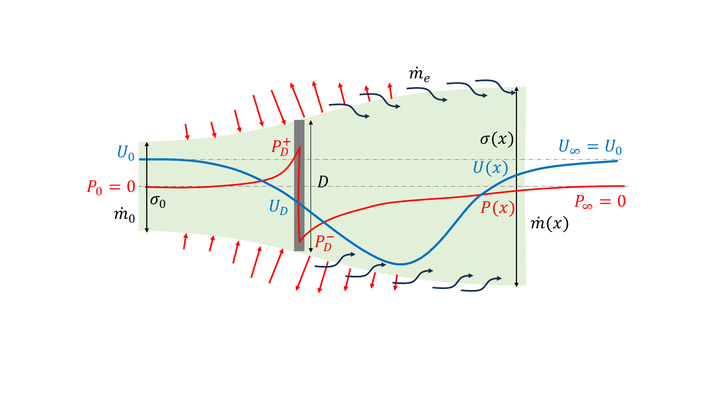

# Generalised Actuator Disk Theory — Visualization Notebooks

The **generalised actuator disk theory** extends the classical formulation by:
1. Describing how flow properties — velocity ($U$), pressure ($P$), and cross-sectional area ($\sigma$) — vary with the streamwise coordinate $x$, rather than limiting the analysis to far-upstream and far-downstream conditions.  
2. Incorporating the effects of **turbulent mixing** in the wake and its contribution to wake recovery.  
3. Providing **physically consistent predictions** of the thrust coefficient ($C_T$) for a given induction factor ($a$), or vice versa, for highly loaded disks.

----------------------------------------

This repository accompanies the paper **“Generalised Actuator Disk Theory”** ([arXiv:2510.08213](https://arxiv.org/abs/2510.08213)) and provides Jupyter notebooks that reproduce **Figure 6** and **Figure 8** from the manuscript. These notebooks demonstrate the flow development, wake recovery, and thrust characteristics predicted by the model.
